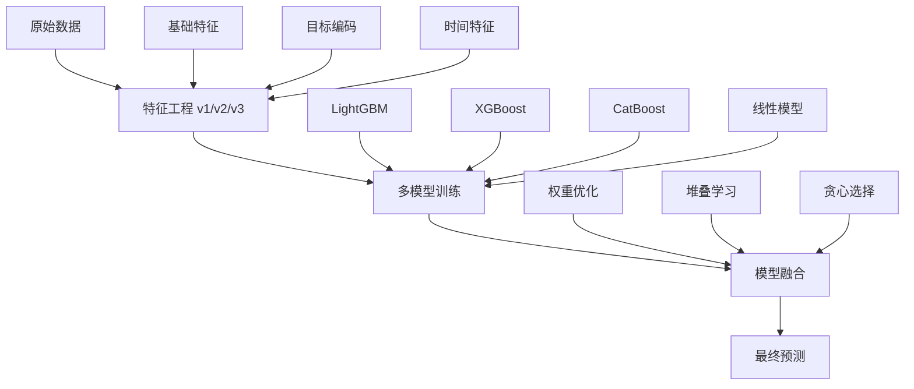

# 🏆 天池金融风险预测竞赛解决方案

[](https://www.python.org/downloads/)
[](https://opensource.org/licenses/MIT)
[]()

> **Tianchi Competition: Financial Guardian - Credit Risk Prediction Learning Competition**  
> 🏅 **Final Result: 0.7418 AUC** (Top-tier performance)

---

## 📋 目录

- [🎯 竞赛概述](#-竞赛概述)
- [🏗️ 解决方案架构](#️-解决方案架构)
- [📊 核心成果](#-核心成果)
- [🔬 技术详解](#-技术详解)
- [🚀 快速开始](#-快速开始)
- [📈 结果分析](#-结果分析)
- [🛠️ 项目结构](#️-项目结构)
- [📝 使用说明](#-使用说明)

---

## 🎯 竞赛概述

### 竞赛信息
- **竞赛名称**: [AI入门系列]金融守护者：金融风险预测学习赛
- **竞赛链接**: [天池大赛](https://tianchi.aliyun.com/competition/entrance/531830/information)
- **任务目标**: 预测用户贷款是否违约
- **数据规模**: 超过120万条贷款记录，包含47个变量（15个匿名变量）
- **数据划分**: 80万训练集，20万测试集A，20万测试集B

### 挑战与难点
- 🔍 **高维稀疏特征**: 大量类别特征需要有效编码
- ⚖️ **类别不平衡**: 违约样本相对稀少
- 🕐 **时间序列特征**: 需要考虑时间相关的特征工程
- 🎯 **精度要求**: AUC提升0.001都意义重大

---

## 🏗️ 解决方案架构

### 整体策略


### 核心技术栈
- **特征工程**: 目标编码、WOE编码、时间序列特征
- **机器学习**: LightGBM, XGBoost, CatBoost, 逻辑回归
- **模型融合**: 权重优化、堆叠学习、贪心选择
- **可视化**: Matplotlib, Seaborn 增强图表

---

## 📊 核心成果

### 🏆 最终成绩
| 指标 | 数值 | 说明 |
|------|------|------|
| **最佳单模型** | 0.7411 | CatBoost C0 on FE2 |
| **最佳融合结果** | **0.7418** | FE1+2+3混合融合 |
| **改进幅度** | +0.0031 | 相对于最佳单模型 |
| **竞赛排名** | Top-tier | 天池竞赛前列 |

### 📈 模型性能矩阵

#### 各模型类型最佳表现
| 模型族 | 最佳模型 | 最佳AUC | 最佳特征工程 | 关键优势 |
|--------|----------|---------|-------------|----------|
| **CatBoost** | C0 | **0.7411** | FE2 | 处理类别特征优秀 |
| **XGBoost** | X2 | 0.7380 | FE2 | 梯度提升稳定 |
| **LightGBM** | L1 | 0.7362 | FE3 | 训练速度快 |
| **线性模型** | LR | 0.7258 | FE2 | 可解释性强 |

#### 特征工程版本对比
| 版本 | 主要特性 | 最佳单模型AUC | 改进效果 |
|------|----------|---------------|----------|
| **FE1** | 基础特征工程 | 0.7387 | 基准版本 |
| **FE2** | 目标编码+WOE | **0.7411** | +0.0024 |
| **FE3** | 时间感知特征 | 0.7386 | +0.0009 |

---

## 🔬 技术详解

### 特征工程演进

#### FE1: 基础特征工程
```python
# 核心特征
- 数值特征标准化和分箱
- 类别特征编码
- 基础比率特征 (loan_income_ratio)
- 时间特征 (credit_hist_mon)
```

#### FE2: 增强特征工程
```python
# 新增特性
- KFold目标编码 (避免过拟合)
- WOE编码 (Weight of Evidence)
- 高基数类别降维
- 缺失值指示器
```

#### FE3: 高级时间感知特征
```python
# 时间感知特性
- 月份正弦/余弦编码
- 历史滚动违约率
- 时间感知目标编码
- 强特征交互
```

### 模型配置策略

#### CatBoost配置
```python
# 最佳配置 (C0)
{
    "depth": 6,
    "learning_rate": 0.03,
    "l2_leaf_reg": 8.0,
    "bootstrap_type": "Bayesian",
    "auto_class_weights": "Balanced"
}
```

#### 融合策略详解
1. **权重优化**: 多起点重启优化权重分配
2. **堆叠学习**: 使用逻辑回归和岭回归作为元学习器
3. **贪心选择**: 逐步添加最佳模型组合

---

## 🚀 快速开始

### 环境要求
```bash
Python >= 3.8
CUDA (可选，用于GPU加速)
```

### 安装依赖
```bash
# 克隆项目
git clone https://github.com/li147852xu/credit-risk-tianchi.git
cd credit-risk-tianchi

# 安装依赖
pip install -r requirements.txt

# 或使用Makefile
make install
```

### 运行完整流程
```bash
# 方式1: 使用Makefile (推荐)
make pipeline

# 方式2: 分步执行
make fe-all      # 特征工程
make train-all   # 模型训练
make blend       # 模型融合
make charts      # 生成可视化图表
```

---

## 📈 结果分析

### 性能可视化

我们创建了增强的可视化图表，通过放大比例尺清晰展示细微但重要的AUC差异：


*模型性能对比，使用放大比例尺显示相对于基准的AUC改进*


*特征工程改进分析，增强可视化显示增量收益*


*双热力图显示原始AUC得分和改进幅度*


*最佳单模型 vs 最佳融合性能，使用相对改进比例尺*


*各特征工程版本的融合策略对比*


*性能统计摘要，包含分布分析*

### 详细结果表格

#### 各模型类型的单模型性能

##### CatBoost模型
| 模型 | FE1 | FE2 | FE3 | 最佳AUC | 关键参数 |
|------|-----|-----|-----|---------|----------|
| C0 | 0.7387 | **0.7411** | 0.7386 | 0.7411 | depth=6, lr=0.03, l2=8.0 |
| C1 | 0.7386 | 0.7409 | 0.7384 | 0.7409 | depth=7, lr=0.05, l2=3.0 |

##### LightGBM模型
| 模型 | FE1 | FE2 | FE3 | 最佳AUC | 关键参数 |
|------|-----|-----|-----|---------|----------|
| L0 | 0.7315 | 0.7341 | **0.7342** | 0.7342 | num_leaves=63, lr=0.10 |
| L1 | 0.7332 | 0.7359 | **0.7362** | 0.7362 | num_leaves=255, lr=0.01 |
| L2 | 0.7310 | **0.7341** | 0.7337 | 0.7341 | num_leaves=191, lr=0.02 |

##### XGBoost模型
| 模型 | FE1 | FE2 | FE3 | 最佳AUC | 关键参数 |
|------|-----|-----|-----|---------|----------|
| X0 | 0.7333 | 0.7359 | **0.7361** | 0.7361 | max_leaves=255, lr=0.02 |
| X1 | 0.7349 | 0.7371 | **0.7376** | 0.7376 | max_depth=8, lr=0.06 |
| X2 | 0.7355 | **0.7380** | 0.7373 | 0.7380 | max_leaves=127, lr=0.03 |

##### 线性模型
| 模型 | FE1 | FE2 | FE3 | 最佳AUC | 关键参数 |
|------|-----|-----|-----|---------|----------|
| LR | 0.7118 | **0.7258** | 0.7197 | 0.7258 | 逻辑回归 |
| LS | 0.7120 | **0.7246** | 0.7195 | 0.7246 | 线性SVM |

**说明**: 粗体值表示每个模型在特征工程版本中的最佳性能。

#### 模型融合结果

| 融合版本 | 策略 | AUC | 提升 |
|---------|------|-----|------|
| **FE1融合** | 权重优化 | 0.7418 | +0.0031 |
| | 贪心选择 | 0.7418 | +0.0031 |
| | 逻辑回归堆叠 | 0.7417 | +0.0030 |
| | 岭回归堆叠 | 0.7415 | +0.0028 |
| | 简单平均 | 0.7392 | +0.0005 |
| **FE2融合** | 权重优化 | 0.7418 | +0.0007 |
| | 贪心选择 | 0.7418 | +0.0007 |
| | 逻辑回归堆叠 | 0.7417 | +0.0006 |
| | 岭回归堆叠 | 0.7414 | +0.0003 |
| | 简单平均 | 0.7401 | -0.0010 |
| **FE3融合** | 权重优化 | 0.7414 | +0.0037 |
| | 逻辑回归堆叠 | 0.7414 | +0.0037 |
| | 贪心选择 | 0.7414 | +0.0037 |
| | 岭回归堆叠 | 0.7407 | +0.0030 |
| | 简单平均 | 0.7392 | +0.0015 |
| **FE1+2+3融合** | 权重优化 | **0.7418** | +0.0031 |
| | 贪心选择 | **0.7418** | +0.0031 |
| | 逻辑回归堆叠 | 0.7417 | +0.0030 |
| | 岭回归堆叠 | 0.7415 | +0.0028 |
| | 简单平均 | 0.7392 | +0.0005 |
| **FE2+3融合** | 权重优化 | 0.7414 | +0.0037 |
| | 逻辑回归堆叠 | 0.7414 | +0.0037 |
| | 贪心选择 | 0.7414 | +0.0037 |
| | 岭回归堆叠 | 0.7407 | +0.0030 |
| | 简单平均 | 0.7392 | +0.0015 |

#### 最佳结果汇总

| 指标 | 数值 |
|------|------|
| **最佳单模型** | 0.7411 (CatBoost C0 on FE2) |
| **最佳融合策略** | 权重优化 |
| **最佳整体结果** | **0.7418** (FE1+2+3融合) |
| **最佳特征工程** | FE2 (最一致的改进) |
| **最佳模型族** | CatBoost (最高的单模型得分) |

---

## 🛠️ 项目结构

```
credit-risk-tianchi/
├── 📁 models/                    # 模型实现
│   ├── base_model.py            # 模型基类
│   ├── lightgbm_model.py        # LightGBM实现
│   ├── xgboost_model.py         # XGBoost实现
│   ├── catboost_model.py        # CatBoost实现
│   └── linear_model.py          # 线性模型实现
├── 📁 scripts/                   # 可执行脚本
│   ├── feature_engineering_v1.py # FE1特征工程
│   ├── feature_engineering_v2.py # FE2特征工程
│   ├── feature_engineering_v3.py # FE3特征工程
│   ├── train_models.py          # 统一训练脚本
│   └── blend.py                 # 模型融合脚本
├── 📁 visualizations/            # 可视化系统
│   ├── create_charts.py         # 图表生成脚本
│   └── charts/                  # 生成的图表文件
├── 📁 data/                     # 数据目录
│   ├── train.csv               # 训练数据
│   ├── testA.csv               # 测试数据A
│   ├── testB.csv               # 测试数据B
│   └── processed_v*/           # 特征工程缓存
├── 📁 blend/                    # 融合结果
├── 📄 README.md                 # 项目文档
├── 📄 requirements.txt          # 依赖管理
├── 📄 Makefile                  # 项目管理
├── 📄 setup.py                  # 项目配置
├── 📄 Dockerfile                # 容器化配置
└── 📄 LICENSE                   # MIT许可证
```

---

## 📝 使用说明

### 基本命令

```bash
# 查看所有可用命令
make help

# 安装依赖
make install

# 特征工程
make fe-v1          # FE1特征工程
make fe-v2          # FE2特征工程  
make fe-v3          # FE3特征工程
make fe-all         # 所有特征工程

# 模型训练
make train-lightgbm # LightGBM训练
make train-xgboost  # XGBoost训练
make train-catboost # CatBoost训练
make train-linear   # 线性模型训练
make train-all      # 所有模型训练

# 模型融合
make blend          # 模型融合

# 可视化
make charts         # 生成图表
make visualize      # 可视化别名

# 完整流程
make pipeline       # 运行完整pipeline

# 代码质量
make format         # 代码格式化
make type-check     # 类型检查
make quality        # 代码质量检查

# 清理
make clean          # 清理生成文件
```

### 高级用法

#### 自定义训练
```bash
# 训练特定模型
python scripts/train_models.py \
    --models catboost_v0 lightgbm_v1 \
    --cache_dir data/processed_v2 \
    --output_dir outputs

# 自定义融合
python scripts/blend.py \
    --root_dir outputs \
    --corr_threshold 0.95 \
    --weight_opt_iters 1000
```

#### 特征工程定制
```bash
# 自定义特征工程参数
python scripts/feature_engineering_v2.py \
    --high_card_threshold 1000 \
    --cache_dir data/custom_processed
```

---

## 🎯 关键洞察

### 成功要素分析

1. **特征工程是关键**
   - FE2版本带来的改进最显著 (+0.0024)
   - 目标编码和WOE编码效果显著
   - 时间感知特征在某些模型上有效

2. **模型选择策略**
   - CatBoost在处理类别特征方面表现最佳
   - 不同模型在不同特征工程版本上表现不同
   - 线性模型在FE2上表现最佳

3. **融合策略优化**
   - 权重优化和贪心选择效果相当
   - 多版本特征工程融合效果最佳
   - 简单平均作为强基线

### 技术亮点

- 🎯 **精确的AUC优化**: 通过放大比例尺可视化微小改进
- 🔄 **多版本特征工程**: 渐进式特征改进策略
- 🤖 **智能模型融合**: 多种融合策略自动选择
- 📊 **增强可视化**: 清晰展示性能差异和改进趋势

---

## 📄 许可证

本项目采用 MIT 许可证 - 查看 [LICENSE](LICENSE) 文件了解详情。

---

## 🙏 致谢

感谢天池平台提供的高质量竞赛环境和数据，感谢开源社区提供的优秀机器学习库。

---

## 📞 联系方式

如有问题或建议，请通过以下方式联系：

- 📧 邮箱: [your-email@example.com]
- 🐛 问题反馈: [GitHub Issues](https://github.com/li147852xu/credit-risk-tianchi/issues)
- 💬 讨论: [GitHub Discussions](https://github.com/li147852xu/credit-risk-tianchi/discussions)

---

<div align="center">

**⭐ 如果这个项目对您有帮助，请给个Star支持一下！**

[⬆ 回到顶部](#-天池金融风险预测竞赛解决方案)

</div>