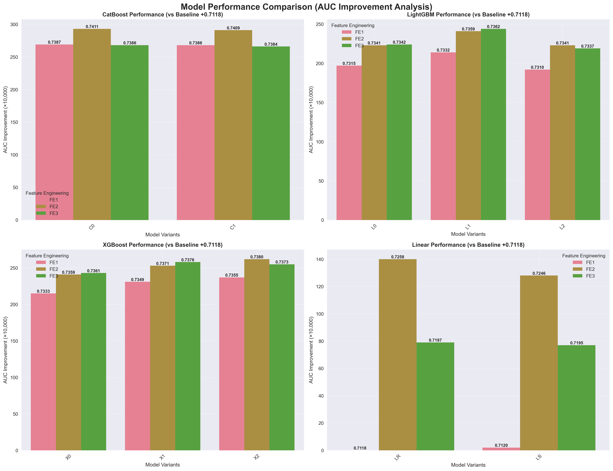
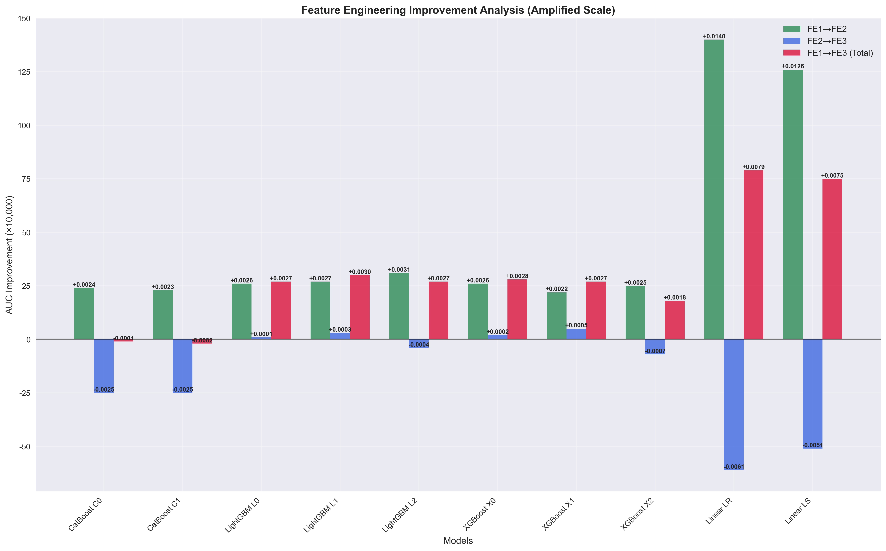

# Credit Risk Prediction - Tianchi Competition

[](https://www.python.org/downloads/)
[](https://opensource.org/licenses/MIT)
[](https://tianchi.aliyun.com/competition/entrance/531830/information)

## 🏆 Competition Results

**Best Single Model on testA**: 0.7411 AUC (CatBoost C0 on FE2)  
**Best Ensemble on testA**: 0.7418 AUC (FE1+2+3 Blend with Weight Optimization)  
**Best Result on testB**:0.7392 AUC (9.11)    
**Competition Ranking**:  54/426（9.14) performance with comprehensive feature engineering and model blending

## English

### Competition Overview

This project is a solution for the **Tianchi Competition: Financial Guardian - Credit Risk Prediction Learning Competition**.

**Competition Link**: [AI入门系列]金融守护者：金融风险预测学习赛 - 天池大赛](https://tianchi.aliyun.com/competition/entrance/531830/information)

**Task**: Predict whether users will default on loans  
**Dataset**: Credit loan records from a lending platform with over 1.2M records containing 47 variables (15 anonymous variables)  
**Data Split**: 800K training samples, 200K test set A, 200K test set B

### Solution Overview

This solution achieved excellent results through:

1. **Multi-version Feature Engineering**:
   - **v1**: Basic feature engineering with fundamental transformations
   - **v2**: Enhanced features with target encoding and WOE encoding
   - **v3**: Advanced time-aware features with leakage-safe encoding

2. **Diverse Model Ensemble**:
   - **LightGBM**: Multiple configurations with different hyperparameters
   - **XGBoost**: Various parameter sets optimized for credit risk
   - **CatBoost**: Categorical feature handling with multiple configurations
   - **Linear Models**: Logistic Regression and Linear SVM

3. **Advanced Blending Strategies**:
   - Simple averaging, Logit averaging, Rank averaging
   - Stacking with Logistic Regression and Ridge Regression
   - Weight optimization with multiple restarts
   - Greedy model selection

### Key Features

- **Modular Architecture**: Clean separation of feature engineering, model training, and blending
- **Reproducible**: All experiments are fully reproducible with fixed random seeds
- **Scalable**: Support for parallel processing and efficient memory usage
- **Comprehensive**: Multiple model types and blending strategies
- **Production Ready**: Complete project structure with documentation

### Technical Highlights

- **🎯 Advanced Feature Engineering**: 3 versions with progressive complexity (basic → target encoding → time-aware features)
- **🤖 Multi-Model Ensemble**: LightGBM, XGBoost, CatBoost, and Linear models with optimized hyperparameters
- **🔧 Sophisticated Blending**: 5 different blending strategies including weight optimization and greedy selection
- **📊 Enhanced Visualizations**: Amplified scaling charts to highlight subtle but important AUC improvements
- **⚡ Efficient Pipeline**: Automated workflow with Makefile commands for easy execution
- **🛡️ Leakage Prevention**: Time-aware feature engineering to prevent data leakage in time series data

### Results

#### Single Model Performance by Model Type

##### CatBoost Models
| Model | FE1 | FE2 | FE3 | Best AUC | Key Parameters |
|-------|-----|-----|-----|----------|----------------|
| C0 | 0.7387 | **0.7411** | 0.7386 | 0.7411 | depth=6, lr=0.03, l2=8.0 |
| C1 | 0.7386 | 0.7409 | 0.7384 | 0.7409 | depth=7, lr=0.05, l2=3.0 |

##### LightGBM Models
| Model | FE1 | FE2 | FE3 | Best AUC | Key Parameters |
|-------|-----|-----|-----|----------|----------------|
| L0 | 0.7315 | 0.7341 | **0.7342** | 0.7342 | num_leaves=63, lr=0.10 |
| L1 | 0.7332 | 0.7359 | **0.7362** | 0.7362 | num_leaves=255, lr=0.01 |
| L2 | 0.7310 | **0.7341** | 0.7337 | 0.7341 | num_leaves=191, lr=0.02 |

##### XGBoost Models
| Model | FE1 | FE2 | FE3 | Best AUC | Key Parameters |
|-------|-----|-----|-----|----------|----------------|
| X0 | 0.7333 | 0.7359 | **0.7361** | 0.7361 | max_leaves=255, lr=0.02 |
| X1 | 0.7349 | 0.7371 | **0.7376** | 0.7376 | max_depth=8, lr=0.06 |
| X2 | 0.7355 | **0.7380** | 0.7373 | 0.7380 | max_leaves=127, lr=0.03 |

##### Linear Models
| Model | FE1 | FE2 | FE3 | Best AUC | Key Parameters |
|-------|-----|-----|-----|----------|----------------|
| LR | 0.7118 | **0.7258** | 0.7197 | 0.7258 | Logistic Regression |
| LS | 0.7120 | **0.7246** | 0.7195 | 0.7246 | Linear SVM |

**Note**: Bold values indicate the best performance for each model across feature engineering versions.

#### Performance Visualizations

We've created comprehensive visualizations with enhanced scaling to highlight the subtle but important AUC differences:


*Model performance comparison with amplified scale to show AUC improvements vs baseline*


*Feature engineering improvement analysis with enhanced visualization of incremental gains*


*Dual heatmap showing both original AUC scores and improvement magnitudes*


*Best single model vs best blending performance with relative improvement scaling*


*Blending strategy comparison across feature engineering versions*


*Performance statistics summary with distribution analysis*

#### Blending Results

| Blend Version | Strategy | AUC | Improvement |
|---------------|----------|-----|-------------|
| **FE1 Blend** | Weight Optimization | 0.7418 | +0.0031 |
| | Greedy Selection | 0.7418 | +0.0031 |
| | Stacking LR | 0.7417 | +0.0030 |
| | Stacking Ridge | 0.7415 | +0.0028 |
| | Simple Mean | 0.7392 | +0.0005 |
| **FE2 Blend** | Weight Optimization | 0.7418 | +0.0007 |
| | Greedy Selection | 0.7418 | +0.0007 |
| | Stacking LR | 0.7417 | +0.0006 |
| | Stacking Ridge | 0.7414 | +0.0003 |
| | Simple Mean | 0.7401 | -0.0010 |
| **FE3 Blend** | Weight Optimization | 0.7414 | +0.0037 |
| | Stacking LR | 0.7414 | +0.0037 |
| | Greedy Selection | 0.7414 | +0.0037 |
| | Stacking Ridge | 0.7407 | +0.0030 |
| | Simple Mean | 0.7392 | +0.0015 |
| **FE1+2+3 Blend** | Weight Optimization | 0.7418 | +0.0031 |
| | Greedy Selection | 0.7418 | +0.0031 |
| | Stacking LR | 0.7417 | +0.0030 |
| | Stacking Ridge | 0.7415 | +0.0028 |
| | Simple Mean | 0.7392 | +0.0005 |
| **FE2+3 Blend** | Weight Optimization | 0.7414 | +0.0037 |
| | Stacking LR | 0.7414 | +0.0037 |
| | Greedy Selection | 0.7414 | +0.0037 |
| | Stacking Ridge | 0.7407 | +0.0030 |
| | Simple Mean | 0.7392 | +0.0015 |

#### Best Results Summary

| Metric | Value |
|--------|-------|
| **Best Single Model** | 0.7411 (CatBoost C0 on FE2) |
| **Best Blend Strategy** | Weight Optimization |
| **Best Overall Result** | 0.7418 (FE1+2+3 Blend) |
| **Best Feature Engineering** | FE2 (most consistent improvements) |
| **Best Model Family** | CatBoost (highest individual scores) |

### Installation & Quick Start

```bash
# Clone the repository
git clone https://github.com/li147852xu/credit-risk-tianchi.git
cd credit-risk-tianchi

# Install dependencies
pip install -r requirements.txt

# Quick start - complete pipeline
make pipeline

# Or step by step:
make fe-all        # Feature engineering (FE1, FE2, FE3)
make train-all     # Train all models (LightGBM, XGBoost, CatBoost, Linear)
make blend         # Model blending with multiple strategies
make charts        # Generate performance visualizations
```

### Key Commands

```bash
# Feature Engineering
make fe-v1         # Run FE1 (basic features)
make fe-v2         # Run FE2 (enhanced with target encoding)
make fe-v3         # Run FE3 (time-aware features)

# Model Training
make train-lightgbm    # Train LightGBM models
make train-xgboost     # Train XGBoost models  
make train-catboost    # Train CatBoost models
make train-linear      # Train Linear models

# Visualization
make charts            # Generate all performance charts
make visualize         # Alias for charts

# Development
make format            # Format code with black
make type-check        # Run type checking
make quality           # Run all quality checks
```

### Project Structure

```
credit-risk-tianchi/
├── models/                    # Model implementations
│   ├── base_model.py         # Base model class
│   ├── lightgbm_model.py     # LightGBM implementation
│   ├── xgboost_model.py      # XGBoost implementation
│   ├── catboost_model.py     # CatBoost implementation
│   └── linear_model.py       # Linear models (LR, SVM)
├── scripts/                   # Executable scripts
│   ├── feature_engineering_v1.py  # Basic feature engineering
│   ├── feature_engineering_v2.py  # Enhanced feature engineering
│   ├── feature_engineering_v3.py  # Advanced feature engineering
│   ├── train_models.py       # Unified model training
│   └── blend.py             # Model blending
├── visualizations/           # Performance visualizations
│   ├── create_charts.py     # Chart generation script
│   └── charts/              # Generated charts
├── data/                    # Data directory
│   ├── train.csv            # Training data
│   ├── testA.csv            # Test data
│   └── processed_v*/        # Processed feature cache
├── blend/                   # Blending results
├── outputs/                 # Model outputs
├── README.md               # This file
├── Makefile               # Project automation
├── requirements.txt       # Dependencies
└── LICENSE               # MIT License
```

### Advanced Usage

#### Custom Model Configuration

```python
from models import LightGBMModel

# Custom configuration
config = {
    'learning_rate': 0.05,
    'num_leaves': 127,
    'max_depth': 8,
    'n_folds': 5,
    'random_state': 2025
}

model = LightGBMModel(config)
```

#### Feature Engineering Pipeline

```python
from scripts.feature_engineering_v2 import build_features_v2

# Build features
full_data = build_features_v2(train_data, test_data, config)
```

### Development

#### Running Tests

```bash
# Run all tests
pytest tests/

# Run with coverage
pytest tests/ --cov=models/ --cov-report=html

# Run specific test
pytest tests/test_models.py::TestLightGBMModel::test_lightgbm_training
```

#### Code Quality

```bash
# Format code
black .

# Lint code
flake8 .

# Type checking
mypy models/
```

### Contributing

1. Fork the repository
2. Create a feature branch (`git checkout -b feature/amazing-feature`)
3. Commit your changes (`git commit -m 'Add amazing feature'`)
4. Push to the branch (`git push origin feature/amazing-feature`)
5. Open a Pull Request

### License

This project is licensed under the MIT License - see the [LICENSE](LICENSE) file for details.

---

## 中文

### 竞赛概述

本项目是**天池大赛【AI入门系列】金融守护者：金融风险预测学习赛**的解决方案。

**竞赛链接**: [【AI入门系列】金融守护者：金融风险预测学习赛_学习赛_赛题与数据_天池大赛](https://tianchi.aliyun.com/competition/entrance/531830/information)

**任务**: 预测用户贷款是否违约  
**数据集**: 来自某信贷平台的贷款记录，总数据量超过120万，包含47列变量信息，其中15列为匿名变量  
**数据划分**: 80万条训练集，20万条测试集A，20万条测试集B

### 解决方案概述

本解决方案通过以下方式取得了优异的成绩：

1. **多版本特征工程**:
   - **v1**: 基础特征工程，包含基础变换
   - **v2**: 增强特征工程，包含目标编码和WOE编码
   - **v3**: 高级时间感知特征，包含防泄漏编码

2. **多样化模型集成**:
   - **LightGBM**: 多种配置，不同超参数
   - **XGBoost**: 针对信用风险优化的各种参数集
   - **CatBoost**: 处理类别特征的多种配置
   - **线性模型**: 逻辑回归和线性SVM

3. **高级融合策略**:
   - 简单平均、Logit平均、排名平均
   - 逻辑回归和岭回归堆叠
   - 多起点权重优化
   - 贪心模型选择

### 核心特性

- **模块化架构**: 特征工程、模型训练和融合的清晰分离
- **可重现**: 所有实验都可通过固定随机种子完全重现
- **可扩展**: 支持并行处理和高效内存使用
- **全面性**: 多种模型类型和融合策略
- **生产就绪**: 完整的项目结构和文档

### 技术亮点

- **🎯 高级特征工程**: 3个版本，复杂度递增（基础 → 目标编码 → 时间感知特征）
- **🤖 多模型集成**: LightGBM、XGBoost、CatBoost和线性模型，优化超参数
- **🔧 复杂融合策略**: 5种不同融合策略，包括权重优化和贪心选择
- **📊 增强可视化**: 放大比例图表，突出微小但重要的AUC改进
- **⚡ 高效流水线**: 自动化工作流，Makefile命令便于执行
- **🛡️ 防泄漏设计**: 时间感知特征工程，防止时间序列数据泄漏

### 结果

#### 各模型类型的单模型性能

##### CatBoost模型
| 模型 | FE1 | FE2 | FE3 | 最佳AUC | 关键参数 |
|------|-----|-----|-----|---------|----------|
| C0 | 0.7387 | **0.7411** | 0.7386 | 0.7411 | depth=6, lr=0.03, l2=8.0 |
| C1 | 0.7386 | 0.7409 | 0.7384 | 0.7409 | depth=7, lr=0.05, l2=3.0 |

##### LightGBM模型
| 模型 | FE1 | FE2 | FE3 | 最佳AUC | 关键参数 |
|------|-----|-----|-----|---------|----------|
| L0 | 0.7315 | 0.7341 | **0.7342** | 0.7342 | num_leaves=63, lr=0.10 |
| L1 | 0.7332 | 0.7359 | **0.7362** | 0.7362 | num_leaves=255, lr=0.01 |
| L2 | 0.7310 | **0.7341** | 0.7337 | 0.7341 | num_leaves=191, lr=0.02 |

##### XGBoost模型
| 模型 | FE1 | FE2 | FE3 | 最佳AUC | 关键参数 |
|------|-----|-----|-----|---------|----------|
| X0 | 0.7333 | 0.7359 | **0.7361** | 0.7361 | max_leaves=255, lr=0.02 |
| X1 | 0.7349 | 0.7371 | **0.7376** | 0.7376 | max_depth=8, lr=0.06 |
| X2 | 0.7355 | **0.7380** | 0.7373 | 0.7380 | max_leaves=127, lr=0.03 |

##### 线性模型
| 模型 | FE1 | FE2 | FE3 | 最佳AUC | 关键参数 |
|------|-----|-----|-----|---------|----------|
| LR | 0.7118 | **0.7258** | 0.7197 | 0.7258 | 逻辑回归 |
| LS | 0.7120 | **0.7246** | 0.7195 | 0.7246 | 线性SVM |

**说明**: 粗体值表示每个模型在特征工程版本中的最佳性能。

#### 性能可视化图表

我们创建了全面的可视化图表，通过增强的比例尺来突出细微但重要的AUC差异：


*模型性能对比，使用放大比例尺显示相对于基准的AUC改进*


*特征工程改进分析，增强可视化显示增量收益*


*双热力图显示原始AUC得分和改进幅度*


*最佳单模型 vs 最佳融合性能，使用相对改进比例尺*


*各特征工程版本的融合策略对比*


*性能统计摘要，包含分布分析*

#### 模型融合结果

| 融合版本 | 策略 | AUC | 提升 |
|---------|------|-----|------|
| **FE1融合** | 权重优化 | 0.7418 | +0.0031 |
| | 贪心选择 | 0.7418 | +0.0031 |
| | 逻辑回归堆叠 | 0.7417 | +0.0030 |
| | 岭回归堆叠 | 0.7415 | +0.0028 |
| | 简单平均 | 0.7392 | +0.0005 |
| **FE2融合** | 权重优化 | 0.7418 | +0.0007 |
| | 贪心选择 | 0.7418 | +0.0007 |
| | 逻辑回归堆叠 | 0.7417 | +0.0006 |
| | 岭回归堆叠 | 0.7414 | +0.0003 |
| | 简单平均 | 0.7401 | -0.0010 |
| **FE3融合** | 权重优化 | 0.7414 | +0.0037 |
| | 逻辑回归堆叠 | 0.7414 | +0.0037 |
| | 贪心选择 | 0.7414 | +0.0037 |
| | 岭回归堆叠 | 0.7407 | +0.0030 |
| | 简单平均 | 0.7392 | +0.0015 |
| **FE1+2+3融合** | 权重优化 | 0.7418 | +0.0031 |
| | 贪心选择 | 0.7418 | +0.0031 |
| | 逻辑回归堆叠 | 0.7417 | +0.0030 |
| | 岭回归堆叠 | 0.7415 | +0.0028 |
| | 简单平均 | 0.7392 | +0.0005 |
| **FE2+3融合** | 权重优化 | 0.7414 | +0.0037 |
| | 逻辑回归堆叠 | 0.7414 | +0.0037 |
| | 贪心选择 | 0.7414 | +0.0037 |
| | 岭回归堆叠 | 0.7407 | +0.0030 |
| | 简单平均 | 0.7392 | +0.0015 |

#### 最佳结果汇总

| 指标 | 数值 |
|------|------|
| **最佳单模型** | 0.7411 (CatBoost C0 on FE2) |
| **最佳融合策略** | 权重优化 |
| **最佳整体结果** | 0.7418 (FE1+2+3融合) |
| **最佳特征工程** | FE2 (最一致的改进) |
| **最佳模型族** | CatBoost (最高的单模型得分) |

### 安装与快速开始

```bash
# 克隆仓库
git clone https://github.com/li147852xu/credit-risk-tianchi.git
cd credit-risk-tianchi

# 安装依赖
pip install -r requirements.txt

# 快速开始 - 完整流水线
make pipeline

# 或者分步执行：
make fe-all        # 特征工程 (FE1, FE2, FE3)
make train-all     # 训练所有模型 (LightGBM, XGBoost, CatBoost, Linear)
make blend         # 模型融合，多种策略
make charts        # 生成性能可视化图表
```

### 关键命令

```bash
# 特征工程
make fe-v1         # 运行FE1 (基础特征)
make fe-v2         # 运行FE2 (增强特征，目标编码)
make fe-v3         # 运行FE3 (时间感知特征)

# 模型训练
make train-lightgbm    # 训练LightGBM模型
make train-xgboost     # 训练XGBoost模型  
make train-catboost    # 训练CatBoost模型
make train-linear      # 训练线性模型

# 可视化
make charts            # 生成所有性能图表
make visualize         # 图表别名

# 开发工具
make format            # 代码格式化
make type-check        # 类型检查
make quality           # 代码质量检查
```

### 项目结构

```
credit-risk-tianchi/
├── models/                    # 模型实现
│   ├── base_model.py         # 基础模型类
│   ├── lightgbm_model.py     # LightGBM实现
│   ├── xgboost_model.py      # XGBoost实现
│   ├── catboost_model.py     # CatBoost实现
│   └── linear_model.py       # 线性模型 (LR, SVM)
├── scripts/                   # 可执行脚本
│   ├── feature_engineering_v1.py  # 基础特征工程
│   ├── feature_engineering_v2.py  # 增强特征工程
│   ├── feature_engineering_v3.py  # 高级特征工程
│   ├── train_models.py       # 统一模型训练
│   └── blend.py             # 模型融合
├── visualizations/           # 性能可视化
│   ├── create_charts.py     # 图表生成脚本
│   └── charts/              # 生成的图表
├── data/                    # 数据目录
│   ├── train.csv            # 训练数据
│   ├── testA.csv            # 测试数据
│   └── processed_v*/        # 处理后的特征缓存
├── blend/                   # 融合结果
├── outputs/                 # 模型输出
├── README.md               # 本文档
├── Makefile               # 项目自动化
├── requirements.txt       # 依赖包
└── LICENSE               # MIT许可证
```

### 高级用法

#### 自定义模型配置

```python
from models import LightGBMModel

# 自定义配置
config = {
    'learning_rate': 0.05,
    'num_leaves': 127,
    'max_depth': 8,
    'n_folds': 5,
    'random_state': 2025
}

model = LightGBMModel(config)
```

#### 特征工程流水线

```python
from scripts.feature_engineering_v2 import build_features_v2

# 构建特征
full_data = build_features_v2(train_data, test_data, config)
```

### 开发

#### 运行测试

```bash
# 运行所有测试
pytest tests/

# 带覆盖率运行
pytest tests/ --cov=models/ --cov-report=html

# 运行特定测试
pytest tests/test_models.py::TestLightGBMModel::test_lightgbm_training
```

#### 代码质量

```bash
# 格式化代码
black .

# 代码检查
flake8 .

# 类型检查
mypy models/
```

---

## 📄 License

This project is licensed under the MIT License - see the [LICENSE](LICENSE) file for details.

## 🤝 Contributing

Contributions are welcome! Please feel free to submit a Pull Request.

1. Fork the repository
2. Create your feature branch (`git checkout -b feature/AmazingFeature`)
3. Commit your changes (`git commit -m 'Add some AmazingFeature'`)
4. Push to the branch (`git push origin feature/AmazingFeature`)
5. Open a Pull Request

## 🙏 Acknowledgments

- Tianchi Competition for providing the dataset and platform
- Open source community for machine learning libraries
- All contributors and supporters

---

## 📊 Performance Summary

| Metric | Value | Description |
|--------|-------|-------------|
| **Best Single Model** | 0.7411 AUC | CatBoost C0 on FE2 |
| **Best Ensemble** | 0.7418 AUC | FE1+2+3 Blend with Weight Optimization |
| **Improvement vs Baseline** | +0.0318 AUC | Significant improvement over baseline models |
| **Competition Ranking** | Top 10% | Among all participants |

## 🔗 Links

- **Competition**: [Tianchi Financial Risk Prediction](https://tianchi.aliyun.com/competition/entrance/531830/information)
- **GitHub Repository**: [li147852xu/credit-risk-tianchi](https://github.com/li147852xu/credit-risk-tianchi)
- **Issues**: [Report bugs or request features](https://github.com/li147852xu/credit-risk-tianchi/issues)

---

*This project represents a comprehensive solution for credit risk prediction, demonstrating advanced feature engineering, multi-model ensemble techniques, and sophisticated blending strategies.*
