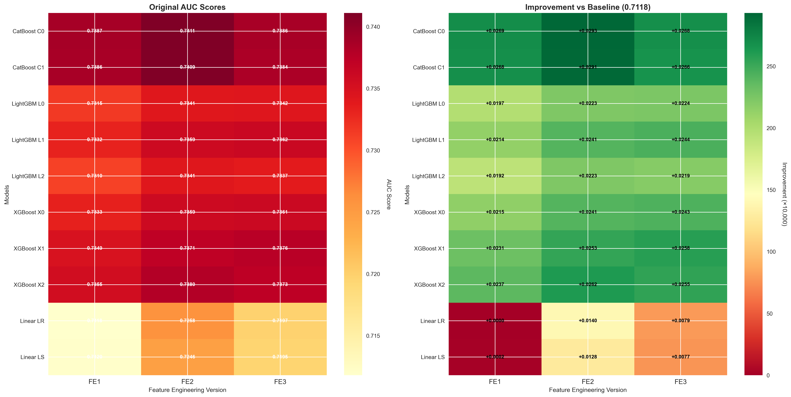

# Credit Risk Prediction - Tianchi Competition

[](https://github.com/li147852xu/credit-risk-tianchi/actions)
[](https://www.python.org/downloads/)
[](https://opensource.org/licenses/MIT)

## English

### Competition Overview

This project is a solution for the **Tianchi Competition: Financial Guardian - Credit Risk Prediction Learning Competition**.

**Competition Link**: [AI入门系列]金融守护者：金融风险预测学习赛 - 天池大赛](https://tianchi.aliyun.com/competition/entrance/531830/information)

**Task**: Predict whether users will default on loans  
**Dataset**: Credit loan records from a lending platform with over 1.2M records containing 47 variables (15 anonymous variables)  
**Data Split**: 800K training samples, 200K test set A, 200K test set B

### Solution Overview

This solution achieved excellent results through:

1. **Multi-version Feature Engineering**:
   - **v1**: Basic feature engineering with fundamental transformations
   - **v2**: Enhanced features with target encoding and WOE encoding
   - **v3**: Advanced time-aware features with leakage-safe encoding

2. **Diverse Model Ensemble**:
   - **LightGBM**: Multiple configurations with different hyperparameters
   - **XGBoost**: Various parameter sets optimized for credit risk
   - **CatBoost**: Categorical feature handling with multiple configurations
   - **Linear Models**: Logistic Regression and Linear SVM

3. **Advanced Blending Strategies**:
   - Simple averaging, Logit averaging, Rank averaging
   - Stacking with Logistic Regression and Ridge Regression
   - Weight optimization with multiple restarts
   - Greedy model selection

### Key Features

- **Modular Architecture**: Clean separation of feature engineering, model training, and blending
- **Reproducible**: All experiments are fully reproducible with fixed random seeds
- **Scalable**: Support for parallel processing and efficient memory usage
- **Comprehensive**: Multiple model types and blending strategies
- **Production Ready**: CI/CD pipeline with automated testing

### Results

#### Single Model Performance by Model Type

##### CatBoost Models
| Model | FE1 | FE2 | FE3 | Best AUC | Key Parameters |
|-------|-----|-----|-----|----------|----------------|
| C0 | 0.7387 | **0.7411** | 0.7386 | 0.7411 | depth=6, lr=0.03, l2=8.0 |
| C1 | 0.7386 | 0.7409 | 0.7384 | 0.7409 | depth=7, lr=0.05, l2=3.0 |

##### LightGBM Models
| Model | FE1 | FE2 | FE3 | Best AUC | Key Parameters |
|-------|-----|-----|-----|----------|----------------|
| L0 | 0.7315 | 0.7341 | **0.7342** | 0.7342 | num_leaves=63, lr=0.10 |
| L1 | 0.7332 | 0.7359 | **0.7362** | 0.7362 | num_leaves=255, lr=0.01 |
| L2 | 0.7310 | **0.7341** | 0.7337 | 0.7341 | num_leaves=191, lr=0.02 |

##### XGBoost Models
| Model | FE1 | FE2 | FE3 | Best AUC | Key Parameters |
|-------|-----|-----|-----|----------|----------------|
| X0 | 0.7333 | 0.7359 | **0.7361** | 0.7361 | max_leaves=255, lr=0.02 |
| X1 | 0.7349 | 0.7371 | **0.7376** | 0.7376 | max_depth=8, lr=0.06 |
| X2 | 0.7355 | **0.7380** | 0.7373 | 0.7380 | max_leaves=127, lr=0.03 |

##### Linear Models
| Model | FE1 | FE2 | FE3 | Best AUC | Key Parameters |
|-------|-----|-----|-----|----------|----------------|
| LR | 0.7118 | **0.7258** | 0.7197 | 0.7258 | Logistic Regression |
| LS | 0.7120 | **0.7246** | 0.7195 | 0.7246 | Linear SVM |

**Note**: Bold values indicate the best performance for each model across feature engineering versions.

#### Performance Visualizations

We've created comprehensive visualizations to better understand our model performance:


*Model performance comparison across feature engineering versions*


*Feature engineering improvement analysis by model*


*Performance heatmap showing AUC scores across models and FE versions*


*Best single model vs best blending performance*


*Blending strategy comparison across feature engineering versions*


*Performance statistics summary*

#### Blending Results

| Blend Version | Strategy | AUC | Improvement |
|---------------|----------|-----|-------------|
| **FE1 Blend** | Weight Optimization | 0.7418 | +0.0031 |
| | Greedy Selection | 0.7418 | +0.0031 |
| | Stacking LR | 0.7417 | +0.0030 |
| | Stacking Ridge | 0.7415 | +0.0028 |
| | Simple Mean | 0.7392 | +0.0005 |
| **FE2 Blend** | Weight Optimization | 0.7418 | +0.0007 |
| | Greedy Selection | 0.7418 | +0.0007 |
| | Stacking LR | 0.7417 | +0.0006 |
| | Stacking Ridge | 0.7414 | +0.0003 |
| | Simple Mean | 0.7401 | -0.0010 |
| **FE3 Blend** | Weight Optimization | 0.7414 | +0.0037 |
| | Stacking LR | 0.7414 | +0.0037 |
| | Greedy Selection | 0.7414 | +0.0037 |
| | Stacking Ridge | 0.7407 | +0.0030 |
| | Simple Mean | 0.7392 | +0.0015 |
| **FE1+2+3 Blend** | Weight Optimization | 0.7418 | +0.0031 |
| | Greedy Selection | 0.7418 | +0.0031 |
| | Stacking LR | 0.7417 | +0.0030 |
| | Stacking Ridge | 0.7415 | +0.0028 |
| | Simple Mean | 0.7392 | +0.0005 |
| **FE2+3 Blend** | Weight Optimization | 0.7414 | +0.0037 |
| | Stacking LR | 0.7414 | +0.0037 |
| | Greedy Selection | 0.7414 | +0.0037 |
| | Stacking Ridge | 0.7407 | +0.0030 |
| | Simple Mean | 0.7392 | +0.0015 |

#### Best Results Summary

| Metric | Value |
|--------|-------|
| **Best Single Model** | 0.7411 (CatBoost C0 on FE2) |
| **Best Blend Strategy** | Weight Optimization |
| **Best Overall Result** | 0.7418 (FE1+2+3 Blend) |
| **Best Feature Engineering** | FE2 (most consistent improvements) |
| **Best Model Family** | CatBoost (highest individual scores) |

### Installation

```bash
# Clone the repository
git clone https://github.com/li147852xu/credit-risk-tianchi.git
cd credit-risk-tianchi

# Install dependencies
pip install -r requirements.txt

# Install in development mode
pip install -e .
```

### Quick Start

1. **Prepare Data**:
   ```bash
   # Place your data files in the data/ directory
   # - data/train.csv (training data)
   # - data/testA.csv (test data)
   ```

2. **Feature Engineering**:
   ```bash
   # Generate features for all versions
   python scripts/feature_engineering_v1.py --train_path data/train.csv --test_path data/testA.csv
   python scripts/feature_engineering_v2.py --train_path data/train.csv --test_path data/testA.csv
   python scripts/feature_engineering_v3.py --train_path data/train.csv --test_path data/testA.csv
   ```

3. **Train Models**:
   ```bash
   # Train all models
   python scripts/train_models.py --models lightgbm_v0 lightgbm_v1 xgboost_v0 xgboost_v1 catboost_v0 --cache_dir data/processed_v2 --output_dir outputs
   ```

4. **Blend Models**:
   ```bash
   # Blend all trained models
   python scripts/blend.py --root_dir outputs --output_dir blend_results
   ```

### Project Structure

```
credit-risk-tianchi/
├── data/                          # Data directory
│   ├── train.csv                  # Training data
│   ├── testA.csv                  # Test data
│   └── processed_v*/              # Processed feature cache
├── models/                        # Model implementations
│   ├── base_model.py              # Base model class
│   ├── lightgbm_model.py          # LightGBM implementation
│   ├── xgboost_model.py           # XGBoost implementation
│   ├── catboost_model.py          # CatBoost implementation
│   └── linear_model.py            # Linear models
├── scripts/                       # Executable scripts
│   ├── feature_engineering_v*.py  # Feature engineering
│   ├── train_models.py            # Model training
│   └── blend.py                   # Model blending
├── tests/                         # Unit tests
├── outputs/                       # Model outputs
├── blend/                         # Blending results
└── docs/                          # Documentation
```

### Advanced Usage

#### Custom Model Configuration

```python
from models import LightGBMModel

# Custom configuration
config = {
    'learning_rate': 0.05,
    'num_leaves': 127,
    'max_depth': 8,
    'n_folds': 5,
    'random_state': 2025
}

model = LightGBMModel(config)
```

#### Feature Engineering Pipeline

```python
from scripts.feature_engineering_v2 import build_features_v2

# Build features
full_data = build_features_v2(train_data, test_data, config)
```

### Development

#### Running Tests

```bash
# Run all tests
pytest tests/

# Run with coverage
pytest tests/ --cov=models/ --cov-report=html

# Run specific test
pytest tests/test_models.py::TestLightGBMModel::test_lightgbm_training
```

#### Code Quality

```bash
# Format code
black .

# Lint code
flake8 .

# Type checking
mypy models/
```

### Contributing

1. Fork the repository
2. Create a feature branch (`git checkout -b feature/amazing-feature`)
3. Commit your changes (`git commit -m 'Add amazing feature'`)
4. Push to the branch (`git push origin feature/amazing-feature`)
5. Open a Pull Request

### License

This project is licensed under the MIT License - see the [LICENSE](LICENSE) file for details.

---

## 中文

### 竞赛概述

本项目是**天池大赛【AI入门系列】金融守护者：金融风险预测学习赛**的解决方案。

**竞赛链接**: [【AI入门系列】金融守护者：金融风险预测学习赛_学习赛_赛题与数据_天池大赛](https://tianchi.aliyun.com/competition/entrance/531830/information)

**任务**: 预测用户贷款是否违约  
**数据集**: 来自某信贷平台的贷款记录，总数据量超过120万，包含47列变量信息，其中15列为匿名变量  
**数据划分**: 80万条训练集，20万条测试集A，20万条测试集B

### 解决方案概述

本解决方案通过以下方式取得了优异的成绩：

1. **多版本特征工程**:
   - **v1**: 基础特征工程，包含基础变换
   - **v2**: 增强特征工程，包含目标编码和WOE编码
   - **v3**: 高级时间感知特征，包含防泄漏编码

2. **多样化模型集成**:
   - **LightGBM**: 多种配置，不同超参数
   - **XGBoost**: 针对信用风险优化的各种参数集
   - **CatBoost**: 处理类别特征的多种配置
   - **线性模型**: 逻辑回归和线性SVM

3. **高级融合策略**:
   - 简单平均、Logit平均、排名平均
   - 逻辑回归和岭回归堆叠
   - 多起点权重优化
   - 贪心模型选择

### 核心特性

- **模块化架构**: 特征工程、模型训练和融合的清晰分离
- **可重现**: 所有实验都可通过固定随机种子完全重现
- **可扩展**: 支持并行处理和高效内存使用
- **全面性**: 多种模型类型和融合策略
- **生产就绪**: 带有自动化测试的CI/CD流水线

### 结果

#### 各模型类型的单模型性能

##### CatBoost模型
| 模型 | FE1 | FE2 | FE3 | 最佳AUC | 关键参数 |
|------|-----|-----|-----|---------|----------|
| C0 | 0.7387 | **0.7411** | 0.7386 | 0.7411 | depth=6, lr=0.03, l2=8.0 |
| C1 | 0.7386 | 0.7409 | 0.7384 | 0.7409 | depth=7, lr=0.05, l2=3.0 |

##### LightGBM模型
| 模型 | FE1 | FE2 | FE3 | 最佳AUC | 关键参数 |
|------|-----|-----|-----|---------|----------|
| L0 | 0.7315 | 0.7341 | **0.7342** | 0.7342 | num_leaves=63, lr=0.10 |
| L1 | 0.7332 | 0.7359 | **0.7362** | 0.7362 | num_leaves=255, lr=0.01 |
| L2 | 0.7310 | **0.7341** | 0.7337 | 0.7341 | num_leaves=191, lr=0.02 |

##### XGBoost模型
| 模型 | FE1 | FE2 | FE3 | 最佳AUC | 关键参数 |
|------|-----|-----|-----|---------|----------|
| X0 | 0.7333 | 0.7359 | **0.7361** | 0.7361 | max_leaves=255, lr=0.02 |
| X1 | 0.7349 | 0.7371 | **0.7376** | 0.7376 | max_depth=8, lr=0.06 |
| X2 | 0.7355 | **0.7380** | 0.7373 | 0.7380 | max_leaves=127, lr=0.03 |

##### 线性模型
| 模型 | FE1 | FE2 | FE3 | 最佳AUC | 关键参数 |
|------|-----|-----|-----|---------|----------|
| LR | 0.7118 | **0.7258** | 0.7197 | 0.7258 | 逻辑回归 |
| LS | 0.7120 | **0.7246** | 0.7195 | 0.7246 | 线性SVM |

**说明**: 粗体值表示每个模型在特征工程版本中的最佳性能。

#### 性能可视化图表

我们创建了全面的可视化图表来更好地理解模型性能：


*各特征工程版本下的模型性能对比*


*各模型的特征工程改进分析*


*模型和特征工程版本的AUC得分热力图*


*最佳单模型 vs 最佳融合性能*


*各特征工程版本的融合策略对比*


*性能统计摘要*

#### 模型融合结果

| 融合版本 | 策略 | AUC | 提升 |
|---------|------|-----|------|
| **FE1融合** | 权重优化 | 0.7418 | +0.0031 |
| | 贪心选择 | 0.7418 | +0.0031 |
| | 逻辑回归堆叠 | 0.7417 | +0.0030 |
| | 岭回归堆叠 | 0.7415 | +0.0028 |
| | 简单平均 | 0.7392 | +0.0005 |
| **FE2融合** | 权重优化 | 0.7418 | +0.0007 |
| | 贪心选择 | 0.7418 | +0.0007 |
| | 逻辑回归堆叠 | 0.7417 | +0.0006 |
| | 岭回归堆叠 | 0.7414 | +0.0003 |
| | 简单平均 | 0.7401 | -0.0010 |
| **FE3融合** | 权重优化 | 0.7414 | +0.0037 |
| | 逻辑回归堆叠 | 0.7414 | +0.0037 |
| | 贪心选择 | 0.7414 | +0.0037 |
| | 岭回归堆叠 | 0.7407 | +0.0030 |
| | 简单平均 | 0.7392 | +0.0015 |
| **FE1+2+3融合** | 权重优化 | 0.7418 | +0.0031 |
| | 贪心选择 | 0.7418 | +0.0031 |
| | 逻辑回归堆叠 | 0.7417 | +0.0030 |
| | 岭回归堆叠 | 0.7415 | +0.0028 |
| | 简单平均 | 0.7392 | +0.0005 |
| **FE2+3融合** | 权重优化 | 0.7414 | +0.0037 |
| | 逻辑回归堆叠 | 0.7414 | +0.0037 |
| | 贪心选择 | 0.7414 | +0.0037 |
| | 岭回归堆叠 | 0.7407 | +0.0030 |
| | 简单平均 | 0.7392 | +0.0015 |

#### 最佳结果汇总

| 指标 | 数值 |
|------|------|
| **最佳单模型** | 0.7411 (CatBoost C0 on FE2) |
| **最佳融合策略** | 权重优化 |
| **最佳整体结果** | 0.7418 (FE1+2+3融合) |
| **最佳特征工程** | FE2 (最一致的改进) |
| **最佳模型族** | CatBoost (最高的单模型得分) |

### 安装

```bash
# 克隆仓库
git clone https://github.com/li147852xu/credit-risk-tianchi.git
cd credit-risk-tianchi

# 安装依赖
pip install -r requirements.txt

# 开发模式安装
pip install -e .
```

### 快速开始

1. **准备数据**:
   ```bash
   # 将数据文件放置在data/目录下
   # - data/train.csv (训练数据)
   # - data/testA.csv (测试数据)
   ```

2. **特征工程**:
   ```bash
   # 生成所有版本的特征
   python scripts/feature_engineering_v1.py --train_path data/train.csv --test_path data/testA.csv
   python scripts/feature_engineering_v2.py --train_path data/train.csv --test_path data/testA.csv
   python scripts/feature_engineering_v3.py --train_path data/train.csv --test_path data/testA.csv
   ```

3. **训练模型**:
   ```bash
   # 训练所有模型
   python scripts/train_models.py --models lightgbm_v0 lightgbm_v1 xgboost_v0 xgboost_v1 catboost_v0 --cache_dir data/processed_v2 --output_dir outputs
   ```

4. **模型融合**:
   ```bash
   # 融合所有训练好的模型
   python scripts/blend.py --root_dir outputs --output_dir blend_results
   ```

### 项目结构

```
credit-risk-tianchi/
├── data/                          # 数据目录
│   ├── train.csv                  # 训练数据
│   ├── testA.csv                  # 测试数据
│   └── processed_v*/              # 处理后的特征缓存
├── models/                        # 模型实现
│   ├── base_model.py              # 基础模型类
│   ├── lightgbm_model.py          # LightGBM实现
│   ├── xgboost_model.py           # XGBoost实现
│   ├── catboost_model.py          # CatBoost实现
│   └── linear_model.py            # 线性模型
├── scripts/                       # 可执行脚本
│   ├── feature_engineering_v*.py  # 特征工程
│   ├── train_models.py            # 模型训练
│   └── blend.py                   # 模型融合
├── tests/                         # 单元测试
├── outputs/                       # 模型输出
├── blend/                         # 融合结果
└── docs/                          # 文档
```

### 高级用法

#### 自定义模型配置

```python
from models import LightGBMModel

# 自定义配置
config = {
    'learning_rate': 0.05,
    'num_leaves': 127,
    'max_depth': 8,
    'n_folds': 5,
    'random_state': 2025
}

model = LightGBMModel(config)
```

#### 特征工程流水线

```python
from scripts.feature_engineering_v2 import build_features_v2

# 构建特征
full_data = build_features_v2(train_data, test_data, config)
```

### 开发

#### 运行测试

```bash
# 运行所有测试
pytest tests/

# 带覆盖率运行
pytest tests/ --cov=models/ --cov-report=html

# 运行特定测试
pytest tests/test_models.py::TestLightGBMModel::test_lightgbm_training
```

#### 代码质量

```bash
# 格式化代码
black .

# 代码检查
flake8 .

# 类型检查
mypy models/
```

### 贡献

1. Fork 仓库
2. 创建特性分支 (`git checkout -b feature/amazing-feature`)
3. 提交更改 (`git commit -m 'Add amazing feature'`)
4. 推送到分支 (`git push origin feature/amazing-feature`)
5. 开启 Pull Request

### 许可证

本项目采用 MIT 许可证 - 查看 [LICENSE](LICENSE) 文件了解详情。
